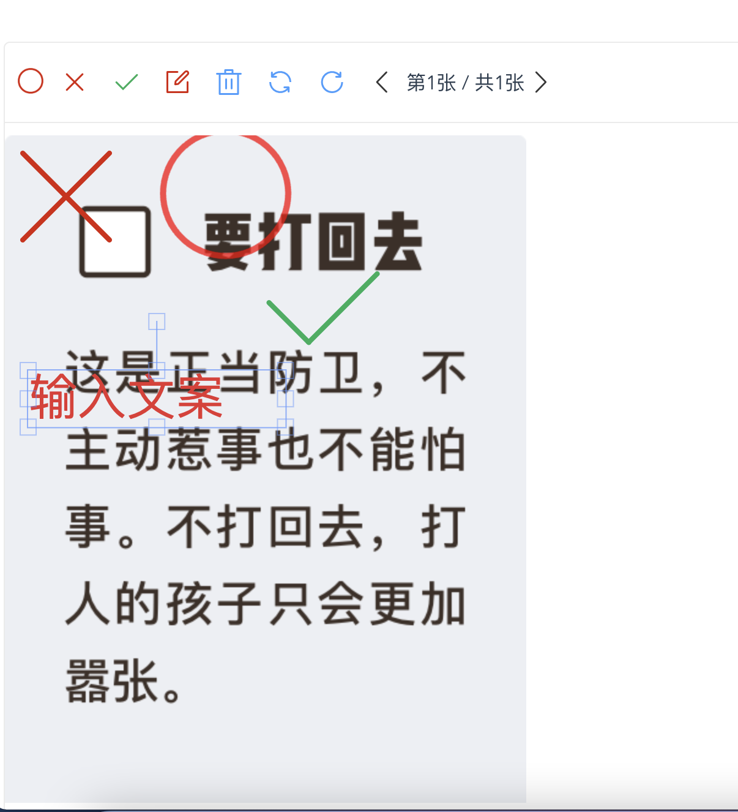
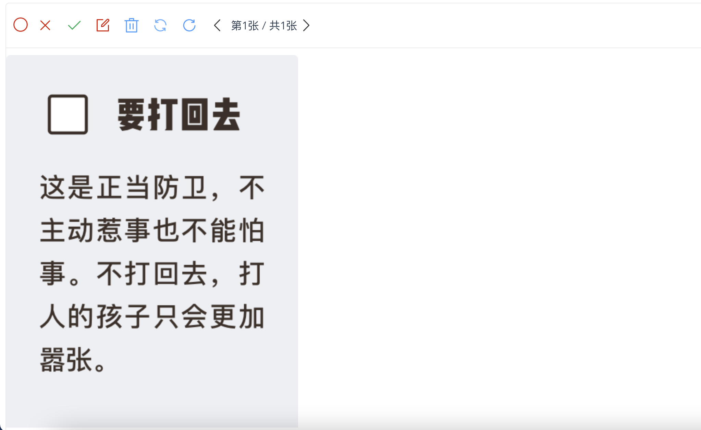

# correctsthetitle


图片编辑组件 vue

可进行图片或者题目的批改答错，主要用户业务场景，教师给学生批改作业。

## 业务场景

主要用于后台项目在图片上做批改，标注等操作

## 编辑功能
- 图形标记（圆 X 对号）
    - 根据自己场景来追加
- 编辑器增加多张修改
- 文字添加
- 删除
- 画布旋转
- 重置 
## 示例





## Project setup
```
npm install
```

### Compiles and hot-reloads for development
```
npm run serve
```

### Compiles and minifies for production
```
npm run build
```

### Lints and fixes files
```
npm run lint
```

### Customize configuration
See [Configuration Reference](https://cli.vuejs.org/config/).
# correctsTheTitle
